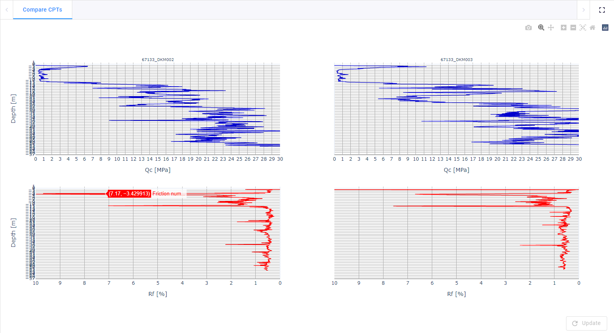
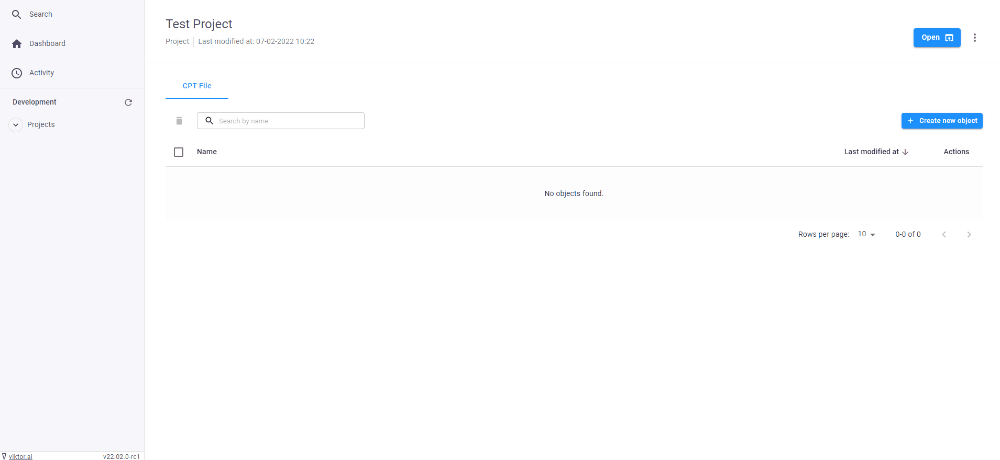

 <Please check version is the same as specified in requirements.txt>

# Compare CPT files
This sample app shows how to compare two CPT's (.gef) 

In this app you can create multiple projects. In each project you can upload CPT files and compare the Qc signals. 
It is possible to plot these signals in 1 figure on in individual figures. Also there is an option to plot the cone resistance.  



here is a gif doing the folowing tasks:
- upload two .gef files
- plot them in individual graphs
- plot them in one graph



## App structure  

```
project_folder: has projects as its children
  └─ project: has cpt files as its children and can compare them in graphs
     └── cpt_file: .gef files (no view/parametrization)     
```
